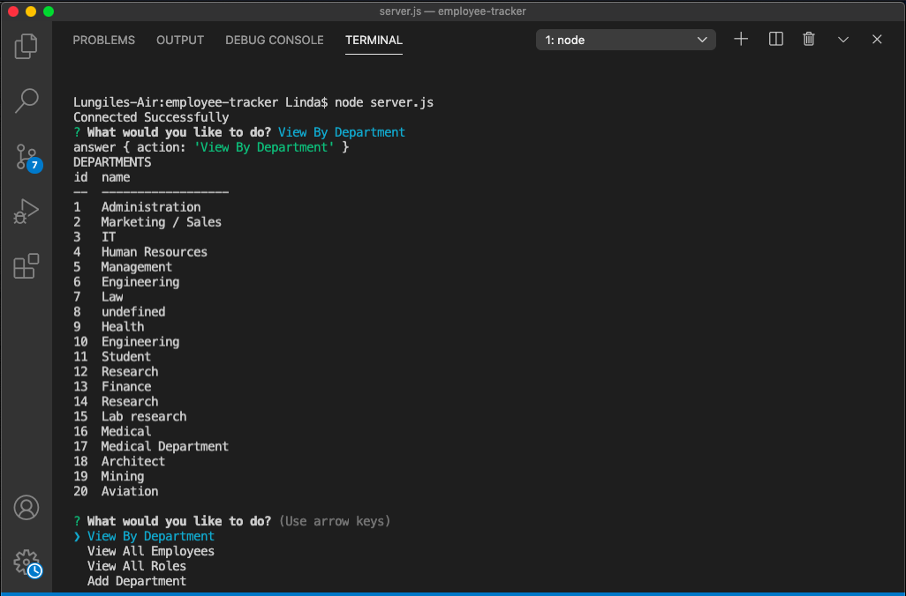

# Employee Tracker

## Description
This is a Content Management System designed to manage and track a companies employee database.

## Table of Contents 
* [Installation](#installation)
* [Usage](#usage)
* [License](#license)
* [Tests](#tests)
* [Questions](#questions)

## Installation
To install necessary dependencies RUN NPM Install and install Inquirer, mySQL and  console.table

## Usage

## License
MIT License

## Tests
To run tests, run the following command:
npm test

## Questions

If you have any questions please contact me directly here: (https://api.github.com/users/LindaHlubi).